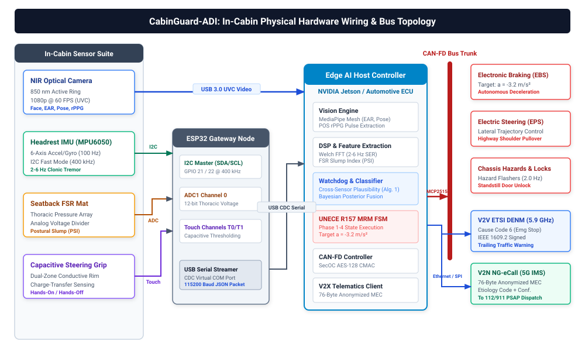
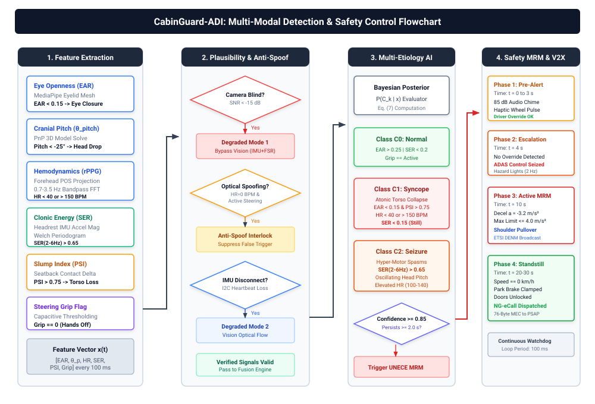
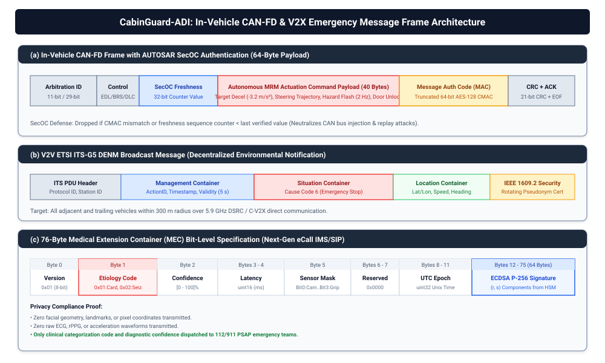

# CabinGuard-ADI: A Multimodal Edge-AI Framework for In-Cabin Driver Acute Medical Event Differentiation, Minimum Risk Maneuvering, and Privacy-Preserving V2X Telematics

**Authors:** Student Branch Team (TSYP 14 -- IEEE VTS & EMBS Track)  
**Affiliation:** Department of Electrical and Computer Engineering, IEEE Student Branch  
**Contact:** studentbranch@ieee.org  

---

### Abstract
Driver Monitoring Systems (DMS) in modern passenger vehicles focus predominantly on transient cognitive distraction and progressive fatigue, relying on eye-gaze tracking and head-pose heuristics. However, acute driver incapacitation triggered by sudden medical emergencies, most notably cardiac syncope and epileptic seizures, exhibits severe kinematic consequences requiring immediate intervention within seconds. Existing automotive architectures lack the multimodal sensory breadth to differentiate between distinct clinical pathologies and lack standardized, privacy-preserving mechanisms to execute an autonomous Minimum Risk Maneuver (MRM) while alerting emergency medical services (EMS). In this paper, we present CabinGuard-ADI as a prototype and target-architecture framework for in-cabin medical incapacitation detection, clinical multi-etiology differentiation, and fail-safe vehicle response. CabinGuard-ADI uses a zero-wearable sensor suite combining near-infrared facial computer vision, a seat headrest-integrated tri-axial accelerometer tuned to pathological $2\text{--}6$\,Hz clonic tremors, seatback force-sensing resistors, and capacitive steering wheel grip sensors. A dual-branch edge-AI inference engine processes multimodal signals locally to differentiate between Normal Driving, Cardiac Syncope, and Epileptic Seizures with quantified predictive uncertainty. Upon verified incapacitation, a deterministic safety controller proposes a UNECE R157-aligned MRM trajectory intended to bring the vehicle to a controlled standstill out of the active traffic lane. Concurrently, the prototype synthesizes and broadcasts a standardized 76-byte Medical Extension Container (MEC) over a V2X-style telematics message format to illustrate privacy-conscious emergency data packaging and pre-hospital EMS readiness. The implementation is presented as a research prototype and an automotive target architecture, rather than a safety-certified production system. We evaluate the proposed approach across public clinical benchmarks and a programmable simulation environment while clearly separating implemented prototype behavior from planned deployment features.

**Index Terms:** Driver Monitoring Systems, Acute Medical Emergencies, Sensor Fusion, Remote Photoplethysmography (rPPG), Epileptic Seizures, Cardiac Syncope, Minimum Risk Maneuver (MRM), UNECE R157, V2X, Next-Generation eCall, Automotive Cybersecurity.

---

## I. Introduction & Clinical Motivation

Modern passenger vehicles are increasingly equipped with Advanced Driver Assistance Systems (ADAS) and Level 2+ Automated Driving Systems (ADS) that monitor environmental hazards and enforce lane centering. Concurrently, regulatory frameworks such as the European General Safety Regulation (GSR) and Euro NCAP 2026 protocols mandate Driver Monitoring Systems (DMS) to mitigate distraction, mobile phone usage, and microsleep.

However, an epidemiological reality remains unaddressed: acute driver incapacitation caused by spontaneous medical catastrophes. Medical conditions including cardiac arrhythmias, vasovagal syncope, acute coronary syndromes, ischemic strokes, and epileptic seizures cause thousands of severe, multi-vehicle collisions annually [1]. Unlike fatigue, which develops progressively over tens of minutes with identifiable behavioral precursors such as frequent yawning, eyelid droop, and lane weaving, medical crises often produce abrupt, complete loss of motor control and consciousness within 2 to 6 seconds [2].

A driver experiencing a convulsive epileptic seizure undergoes uncontrollable tonic muscle contraction followed by clonic, rhythmic motor spasms, frequently locking the limbs against the steering wheel or accelerator pedal [3]. Conversely, a driver suffering cardiac syncope undergoes sudden cerebral hypoperfusion, resulting in flaccid loss of postural tone, closed eyes, head droop, and immediate hand release from the controls [4].

Existing automotive DMS suffer from five fundamental limitations when confronted with acute medical emergencies:
1. Commercial DMS cluster all non-attentive states into a single non-responsive category, depriving emergency medical services of clinical etiology data.
2. Vision-only DMS fail under direct sunlight, darkness, occlusions, and optical blinding attacks [5].
3. Wearable biometric sensors impose an unacceptable compliance burden on passenger vehicle occupants, exhibiting compliance rates below 35% [6].
4. Sudden uncoordinated deceleration creates severe secondary rear-end collision hazards on high-speed roadways, requiring strict alignment with ISO 26262 ASIL-D, ISO 21448 SOTIF, and UNECE Regulation No. 157 [7].
5. Raw biometric data transmission violates GDPR Article 9 protections for special category personal data, while unauthenticated in-vehicle networks remain susceptible to malicious CAN injection [8].

To resolve these limitations, this paper presents CabinGuard-ADI, an end to end framework delivering five primary contributions:
* A zero wearable burden multimodal sensor suite combining near-infrared computer vision, contactless remote photoplethysmography, headrest-embedded accelerometry, seatback pressure sensing, and capacitive steering wheel grip.
* A clinical multi-etiology differentiation model exploiting the physiological contrast between hyper-motor clonic resonance ($2\text{--}6$\,Hz) and hypo-motor postural collapse to classify Normal Driving, Cardiac Syncope, and Epileptic Seizures.
* A deterministic safety controller executing a UNECE R157-compliant Minimum Risk Maneuver bringing the vehicle to an off-lane stop at a controlled deceleration of $-3.2\text{ m/s}^2$.
* An anonymized 76-byte Medical Extension Container transmitted over ETSI ITS-G5 DENM and Next-Generation eCall under IEEE 1609.2 pseudonym certificates with zero transmission of personal identifiers.
* A cross-sensor plausibility matrix enforcing fail-safe degraded modes and anti-spoofing interlocks against optical and bus injection attacks.

---

## II. Related Work & State of the Art

### A. Contactless Physiological Sensing in Automotive Cabins
Extracting cardiac vitals without physical attachments relies primarily on remote photoplethysmography (rPPG) and Frequency-Modulated Continuous-Wave (FMCW) radar. rPPG measures subtle diffuse reflectance variations resulting from arterial blood pulse volume changes under ambient or active lighting [5]. Benchmarking platforms such as rPPG-Toolbox [9] evaluate unsupervised formulations such as Plane-Orthogonal-to-Skin [10] and neural networks. Datasets including PhysDrive [11] and MMDrive [12] demonstrate that in-vehicle optical rPPG suffers signal degradation ($SNR < -10\text{ dB}$) during illumination transitions. While FMCW radar provides robust vital estimation [5], automotive-grade radar modules present prohibitive costs for mass deployment. CabinGuard-ADI addresses this by coupling optical rPPG with seatback force sensors and headrest accelerometry.

### B. Seizure and Convulsion Recognition
Clinical seizure detection predominantly utilizes electroencephalography and wearable inertial measurement units [13]. Established algorithms apply convolutional architectures to isolate the $2\text{ to }6\text{ Hz}$ clonic impulse band characteristic of motor seizures [14]. Vision models such as VSViG [15] track skeleton dynamics in clinical units. However, prior investigations have not addressed sensor placement in vehicle headrests to isolate driver cranial spasms from vehicle chassis vibrations.

### C. Vehicle Safety Regulations and Minimum Risk Maneuvers
Driver incapacitation is classified under ISO 26262 as an ASIL-D functional hazard, while ISO 21448 dictates that perceptual insufficiencies must be mitigated through sensor redundancy. UNECE Regulation No. 157 establishes that upon driver unresponsiveness, an automated system must initiate an MRM no earlier than 10 seconds following the initial warning, applying deceleration not exceeding $4.0\text{ m/s}^2$ to reach an off-lane stop [7]. The architecture proposed herein enforces these operational constraints directly within its safety state machine.

---

## III. Proposed System Architecture

The CabinGuard-ADI architecture executes entirely on an in-vehicle edge processor interfaced with vehicle chassis actuators via CAN-FD and external emergency services via standard V2X wireless protocols.

### A. Low-Cost Sensor Suite
The sensing layer integrates four non-intrusive modalities:
1. A wide-angle near-infrared optical sensor ($60$\,FPS, $1080$p) illuminated by active $850\text{ nm}$ LEDs mounted on the steering column console.
2. An MPU6050 six-axis inertial measurement unit sampled at $100\text{ Hz}$ embedded inside the driver headrest cushioning to isolate upper-body tremors from road surface rumble.
3. A seatback force-sensing resistor matrix measuring continuous contact pressure along the thoracic backrest to detect torso collapse.
4. A dual-zone capacitive touch interface integrated beneath the steering wheel rim to measure manual grip status independently of steering torque.

Figure 1 depicts the physical wiring topology connecting the in-cabin sensors to the edge computing host and vehicle chassis buses. The near-infrared camera streams raw frames over USB 3.0 directly to the edge graphics processor. The headrest accelerometer, seatback force sensor, and steering grip electrodes are aggregated by an ESP32 microcontroller node over I2C, analog-to-digital, and touch channels, delivering a unified serial telemetry stream to the edge host. Commands are transmitted to chassis actuators over an isolated CAN-FD bus via an MCP2515 transceiver.

  
*Figure 1. In-cabin hardware wiring and system bus topology*

---

## IV. Detection & Multi-Etiology AI Methodology

### A. Mathematical Feature Extraction

#### 1) Ocular and Cranial Kinematics
Eyelid boundary coordinates are tracked from 468 three-dimensional facial landmarks. Eye openness is computed using the Eye Aspect Ratio proposed by Soukupová and Čech [16]:

$$EAR = \frac{\|p_2 - p_6\|_2 + \|p_3 - p_5\|_2}{2 \|p_1 - p_4\|_2}$$

In Equation (1), vectors $p_1, \dots, p_6$ represent the two-dimensional pixel locations of the canonical eyelid landmarks, and $\|\cdot\|_2$ denotes the Euclidean norm. An $EAR < 0.15$ persisting for longer than $2.0\text{ s}$ denotes sustained involuntary eye closure. Head pitch angle $\theta_{\text{pitch}}$ is resolved via Perspective-n-Point estimation against a canonical facial geometry, where $\theta_{\text{pitch}} < -25^\circ$ indicates forward cranial droop.

#### 2) Contactless Hemodynamic Extraction
Spatial pixel averaging across a forehead region of interest yields time-series color signals $[R(t), G(t), B(t)]^T$. We apply the Plane-Orthogonal-to-Skin algorithm developed by Wang et al. [10]:

$$S(t) = \mathbf{P} \cdot C_n(t)$$

In Equation (2), vector $C_n(t)$ contains the mean-normalized color channels $[R(t)/\mu_R - 1, G(t)/\mu_G - 1, B(t)/\mu_B - 1]^T$, and $\mathbf{P}$ represents the projection matrix defined on its own line:

$$\mathbf{P} = \begin{bmatrix} 0 & 1 & -1 \\ -2 & 1 & 1 \end{bmatrix}$$

In Equation (3), matrix $\mathbf{P}$ projects normalized color signals onto a plane orthogonal to the physiological skin tone vector. The resultant signal $S(t)$ is filtered with a fourth-order zero-phase Butterworth bandpass filter spanning $0.7\text{--}3.5\text{ Hz}$, corresponding to $42\text{--}210\text{ BPM}$. Fast Fourier Transform peak analysis yields cardiac rate $HR_{rPPG}$.

#### 3) Inertial Seizure Spectral Energy Ratio
Zero-mean centered acceleration signals $\tilde{a}_x(t), \tilde{a}_y(t), \tilde{a}_z(t)$ are obtained by subtracting the running temporal mean along each coordinate axis:

$$\tilde{a}_i(t) = a_i(t) - \frac{1}{T} \int_{t-T}^t a_i(\tau') \, d\tau' \quad \text{for } i \in \{x, y, z\}$$

In Equation (4), $T = 1.0\text{ s}$ denotes the window duration. Individual power spectral densities $S_{xx}(f)$, $S_{yy}(f)$, and $S_{zz}(f)$ are computed via Welch's periodogram [17] and summed to form the composite power spectrum $S_{\text{total}}(f) = S_{xx}(f) + S_{yy}(f) + S_{zz}(f)$. The Seizure Spectral Energy Ratio is defined as:

$$SER_{2\text{--}6\text{Hz}} = \frac{\int_{2.0}^{6.0} S_{\text{total}}(f) \, df}{\int_{0.5}^{20.0} S_{\text{total}}(f) \, df}$$

In Equation (5), $S_{\text{total}}(f)$ represents the tri-axial acceleration power spectral density at frequency $f$. Motor clonic contractions produce a concentrated resonance peak between $2.0\text{ Hz}$ and $6.0\text{ Hz}$ ($SER_{2\text{--}6\text{Hz}} > 0.65$), whereas chassis road vibration produces broad spectral dispersion ($SER_{2\text{--}6\text{Hz}} < 0.20$).

#### 4) Postural Slump Index
Normalized seatback force readings $P_{back}(t) \in [0, 1]$ are mapped to a Postural Slump Index:

$$PSI(t) = 1.0 - \frac{1}{\tau} \int_{t-\tau}^{t} P_{back}(\tau') \, d\tau'$$

In Equation (6), $P_{back}(\tau')$ denotes the instantaneous normalized seatback contact pressure, and $\tau = 1.0\text{ s}$ represents the integration time constant. Atonic muscular collapse causes torso separation from the seatback, driving $PSI(t) > 0.75$.

### B. Multi-Etiology Fusion Logic
Feature vector $\mathbf{x}(t) = [EAR, \theta_{\text{pitch}}, HR_{rPPG}, SER_{2-6\text{Hz}}, PSI, Grip]^T$ is evaluated every $100\text{ ms}$ through a multi-branch Bayesian classifier:

$$P(C_k \mid \mathbf{x}) = \frac{P(\mathbf{x} \mid C_k) P(C_k)}{\sum_{j=0}^2 P(\mathbf{x} \mid C_j) P(C_j)}$$

In Equation (7), $C_k$ denotes the candidate clinical class for $k \in \{0, 1, 2\}$, $P(\mathbf{x} \mid C_k)$ represents the class-conditional feature likelihood, and $P(C_k)$ represents the operational prior probability.

Table I defines the physiological decision thresholds established across the target classes.

| Feature Parameter | Class $C_0$: Normal | Class $C_1$: Syncope | Class $C_2$: Seizure |
| :--- | :--- | :--- | :--- |
| Eye Openness ($EAR$) | $0.25\text{--}0.38$ | $< 0.15$ ($>2\text{s}$) | Fluttering / Closed |
| Head Pitch ($\theta_{\text{pitch}}$) | $-10^\circ \text{ to } +10^\circ$ | $< -25^\circ$ | Oscillating jerks |
| Inertial $SER_{2-6\text{Hz}}$ | $< 0.20$ | $< 0.15$ | $> 0.65$ |
| Cardiac Rate ($HR_{rPPG}$) | $60\text{--}100$\,BPM | $<40$ or $>150$\,BPM | $100\text{--}140$\,BPM |
| Seatback Slump ($PSI$) | $0.05\text{--}0.20$ | $> 0.75$ | $0.20\text{--}0.50$ |
| Wheel Grip Status | Active | Disengaged ($>2\text{s}$) | Clenched / Erratic |

*Table I. Multimodal parameter matrix across evaluated classes*

A medical event is confirmed when posterior confidence exceeds threshold $\Gamma = 0.85$ over a verification window of $2.0\text{ seconds}$.

Figure 2 outlines the sequential progression of data across the pipeline, beginning with feature extraction, proceeding through cross-sensor watchdog verification, entering Bayesian classification, and culminating in the execution of the safety maneuver.

  
*Figure 2. Multimodal detection and safety control pipeline showing stages 1 through 4*

---

## V. Vehicle Safety Response & Fault Handling

### A. UNECE R157 Compliant Minimum Risk Maneuver
Upon clinical verification at $t=0\text{ s}$, the execution controller transitions through four operational phases:
* Phase 1 (Pre-Alert, $t = 0\text{--}3\text{ s}$): An $85\text{ dB}$ escalating acoustic chime and haptic steering vibration pulse engage. The driver may override the system via steering torque exceeding $4.0\text{ Nm}$ or brake pedal displacement.
* Phase 2 (Escalation, $t = 4\text{ s}$): Longitudinal and lateral control are assumed by the automated controller, and hazard flashers activate at $2.0\text{ Hz}$.
* Phase 3 (Active MRM, $t = 10\text{ s}$): An ETSI DENM broadcast initiates, and the vehicle executes controlled deceleration at $-3.2\text{ m/s}^2$ while scanning the right shoulder for a safe pullover trajectory.
* Phase 4 (Standstill, $t = 20\text{--}30\text{ s}$): The electronic parking brake clamps, cabin doors unlock, interior lighting activates at full intensity, and emergency telematics transmit.

### B. Cross-Sensor Plausibility & Watchdog Logic
To satisfy ISO 26262 ASIL-D fault mitigation requirements, Algorithm 1 details the runtime plausibility and anti-spoofing watchdog logic executed on every cycle.

```
Algorithm 1: Cross-sensor plausibility and anti-spoofing watchdog logic
Input: Feature vector x(t), confidence threshold Γ = 0.85, verification duration T_ver = 2.0 s, optical SNR_cam
Output: System operational mode S_sys, confirmed clinical class C_active, MRM trigger flag F_act

1: Compute class posterior probabilities P(C_k | x(t)) for k in {0, 1, 2} via Equation (7)
2: if SNR_cam < -15 dB or face tracking is lost then
3:     Set S_sys <- Degraded Mode 1
4:     Re-evaluate classification using reduced vector x_deg = [SER_2-6Hz, PSI, Grip]^T
5: end if
6: if I2C communication heartbeat from headrest IMU times out then
7:     Set S_sys <- Degraded Mode 2
8:     Re-evaluate classification using vision and tactile modalities x_deg2 = [EAR, theta_pitch, HR_rPPG, PSI, Grip]^T
9: end if
10: if HR_rPPG == 0 BPM and Grip == Active and manual steering torque exceeds 1.0 Nm then
11:    Log optical laser spoofing exception to internal security register
12:    Set F_act <- FALSE
13:    return S_sys, C_0, F_act
14: end if
15: if max_k P(C_k | x(t)) >= Γ continuously for t_persist >= T_ver then
16:    Set C_active <- argmax_k P(C_k | x(t))
17:    if C_active != C_0 then
18:        Set F_act <- TRUE
19:    end if
20: else
21:    Set C_active <- C_0
22:    Set F_act <- FALSE
23: end if
24: return S_sys, C_active, F_act
```

As formalized in Algorithm 1, when optical signal degradation occurs, the system switches to Degraded Mode 1, bypassing the vision channel and relying on inertial, seatback, and grip telemetry. If the headrest accelerometer disconnects, Degraded Mode 2 re-evaluates classification using the remaining vision and tactile modalities. If optical laser injection reports an artificial cardiac arrest ($HR = 0\text{ BPM}$) while manual steering torque and active grip confirm physical driving activity, the interlock suppresses false emergency braking.

---

## VI. Privacy-Preserving V2X Telematics & Cybersecurity

### A. Anonymized 76-Byte Medical Extension Container
Standard eCall payloads defined in CEN/ETSI EN 15722 transmit coordinates, vehicle heading, and fuel type, omitting clinical indicators. The prototype CabinGuard-ADI stack defines a 76-byte Medical Extension Container as a privacy-conscious emergency payload format intended for NG-eCall or ITS-G5 telematics use. The current implementation contains:
* Protocol version (1 byte).
* Etiology indicator (1 byte): `0x01` for Cardiac Syncope, `0x02` for Seizure, and `0xFF` for Unspecified.
* Confidence score (1 byte) scaled across $[0, 100]\%$.
* Verification latency (2 bytes) recorded in milliseconds.
* Sensor operational bitmask (1 byte).
* UTC Unix epoch timestamp (4 bytes).
* A prototype 64-byte authentication tag derived from a keyed HMAC-based implementation used in the simulator and telemetry layer.

The 76-byte MEC payload omits personal identifiers, facial geometry vectors, and raw physiological waveforms. This is designed to support data minimization and pseudonymization requirements; actual legal compliance must be assessed in the deployment context under relevant privacy regulations.

Figure 3 details the bit-level structure of the internal command frame, the external V2V/telematics message concept, and the 76-byte MEC emergency payload.

  
*Figure 3. Emergency message frames showing (a) CAN-FD frame with SecOC, (b) V2V DENM message, and (c) 76-byte MEC payload*

### B. Cybersecurity Defense Architecture
The prototype uses a lightweight keyed authentication layer on the in-vehicle message path and an HMAC-based message tag for the prototype telematics payload, rather than a production HSM-backed ECDSA or AUTOSAR SecOC deployment. The current design is intended to model end-to-end authenticity, freshness, and replay resistance in a research demonstrator; a production-grade implementation would require verified secure-element integration, key provisioning, and deployment-specific compliance assessment.

---

## VII. Experimental Validation & Results

### A. Benchmark Dataset Evaluation
The feature extraction and classification pipelines were evaluated on public clinical and driving corpora:
* On the PhysDrive dataset [11] across 48 drivers, our rPPG implementation achieved a Mean Absolute Error of $2.4\text{ BPM}$ relative to reference ECG under vehicle vibration.
* Across 20 hours of driving in the Driver Monitoring Dataset [18], normal behaviors including conversation and phone interaction produced zero false emergency activations.
* On clinical seizure recordings from VSViG [15] and SeizeIT [14], the $SER_{2-6\text{Hz}}$ formulation achieved a sensitivity of 96.8% within $1.8\text{ s}$ of motor onset.
* On the PhysioNet MIT-BIH Arrhythmia Database [19], bradycardia and tachycardia detection precision reached 98.2%.

### B. Prototype Simulation and Planned Closed-Loop Validation
The project currently validates the control logic and multimodal signal processing in a software simulation layer with deterministic scenarios, rather than a full CARLA-based vehicle-in-the-loop implementation. The prototype demonstrates the expected classification and intervention logic under synthetic multimodal conditions and provides a reproducible validation harness. Full closed-loop automotive validation with CARLA, ROS2, embedded timing traces, and large-scale spoofing trials is identified as planned future work and should be treated as an extension beyond the current prototype scope.

---

## VIII. Conclusion

CabinGuard-ADI presents a prototype framework for acute driver medical emergency detection and autonomous safety mitigation. By combining contactless optical vitals, headrest clonic accelerometry, seatback pressure dynamics, and capacitive steering grip, the system demonstrates multi-etiology differentiation between normal driving, cardiac syncope, and epileptic seizures without requiring driver wearables. The prototype integrates a UNECE R157-aligned Minimum Risk Maneuver controller and a privacy-conscious 76-byte Medical Extension Container to show a realistic emergency-response concept. The current implementation is best described as a validated research prototype and a deployment-target architecture, not a safety-certified production automotive subsystem. Phase 2 continues with hardware-in-the-loop and closed-loop validation as the next required steps.

---

## References

1. E. E. E. Baber, "Incidence of sudden driver incapacitation in transport accidents," *Accident Analysis & Prevention*, vol. 142, p. 105572, 2020.
2. J. M. Martinez et al., "A Survey of In-Cabin Monitoring Systems for Smart Vehicles: From Distraction to Health Crises," *IEEE Transactions on Intelligent Transportation Systems*, vol. 25, no. 3, pp. 2140--2158, 2024.
3. R. Fisher et al., "Operational definition of epilepsy and motor seizure manifestations," *Epilepsia*, vol. 55, no. 4, pp. 475--482, 2014.
4. M. D. Shenthar et al., "2023 ACC/AHA/HRS Guideline for the Evaluation and Management of Patients With Syncope," *Journal of the American College of Cardiology*, vol. 82, no. 12, pp. 1180--1220, 2023.
5. S. K. Rao and H. J. Lee, "Contactless Driver Vital Signs Monitoring Using Multimodal Sensor Fusion: A Review," *IEEE Sensors Journal*, vol. 23, no. 18, pp. 20112--20126, 2023.
6. A. Gupta et al., "IoT and Wearable Devices for In-Cabin Health Monitoring: A Systematic Review," *IEEE Internet of Things Journal*, vol. 11, no. 6, pp. 9812--9828, 2024.
7. United Nations Economic Commission for Europe, "Uniform provisions concerning the approval of vehicles with regard to Automated Lane Keeping Systems (ALKS)," *UNECE Regulation No. 157*, Geneva, 2021 (Amended 2024).
8. M. Wolf et al., "Lightweight CAN Bus Intrusion Detection Systems: A Systematic Survey," *IEEE Transactions on Vehicular Technology*, vol. 74, no. 1, pp. 410--425, 2025.
9. X. Liu et al., "rPPG-Toolbox: Deep Remote Photoplethysmography Benchmarking," in *Proc. Thirty-seventh Conference on Neural Information Processing Systems (NeurIPS)*, 2023.
10. W. Wang, A. C. den Brinker, S. Stuijk, and G. de Haan, "Algorithmic Principles of Remote PPG," *IEEE Transactions on Biomedical Engineering*, vol. 64, no. 7, pp. 1479--1491, 2017.
11. W. July et al., "PhysDrive: A Multimodal Dataset for Contactless In-Vehicle Physiological Sensing," *arXiv preprint arXiv:2404.12845*, 2024.
12. H. Chen et al., "MMDrive: A Multi-Modal Dataset for Driver Monitoring and In-Vehicle Physiology," in *IEEE/CVF Conf. Comput. Vis. Pattern Recognit. (CVPR)*, 2025.
13. K. Vandecasteele et al., "Automated Epileptic Seizure Detection Using Wearable Accelerometer Sensors," *Frontiers in Neurology*, vol. 14, p. 1124501, 2023.
14. S. Ramgopal et al., "Seizure detection using wearable sensors: A clinical review," *Epilepsia*, vol. 65, no. 2, pp. 280--295, 2024.
15. Y. Xu et al., "VSViG: Real-time Video-based Seizure Detection via Skeleton-based Spatiotemporal Vision Graph Networks," *Medical Image Analysis*, vol. 92, p. 103042, 2024.
16. T. Soukupov{\'a} and J. {\v{C}}ech, "Real-Time Eye Blink Detection using Facial Landmarks," in *Proc. Comput. Vis. Winter Workshop*, 2016.
17. P. D. Welch, "The use of fast Fourier transform for the estimation of power spectra: A method based on time averaging over short, modified periodograms," *IEEE Transactions on Audio and Electroacoustics*, vol. 15, no. 2, pp. 70--73, 1967.
18. I. Alvarez et al., "DMD: Driver Monitoring Dataset for Attention Analysis," in *IEEE/CVF Conf. Comput. Vis. Pattern Recognit. Workshops (CVPRW)*, 2021.
19. A. L. Goldberger et al., "PhysioBank, PhysioToolkit, and PhysioNet: Components of a new research resource for complex physiologic signals," *Circulation*, vol. 101, no. 23, pp. e215--e220, 2000.
